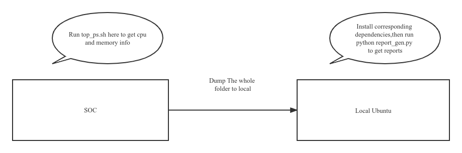
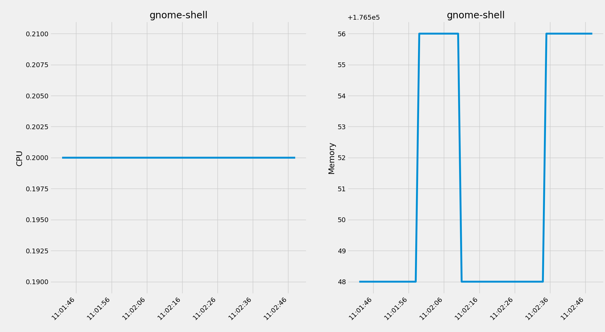
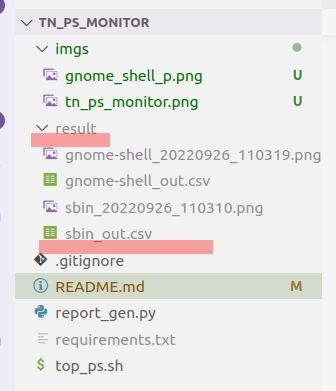

# TN APA PS Monitor Guide

## Background

Since we want to get the current usage of CPU and memory of some of the APA processes, we build this tool to help us.

## Architecture

The architecture of this tool is rather simple. We get the information of CPU& memory usage on the SOC. Then dump the corresponding csv files to local, and use report_gen tool to get the process information line chart. Below is the architecture graph.



## Steps

+ Clone project to local
   
    Currently, I just the put the project on the public github. If we have further concerns about this, I can create a private repo on company's bitbucket.

    You can get the code as belows, we assume that you have git pre-installed on Ubuntu, if not, please install it by yourself. It's just a simple line of shell code.

    ```shell
    git clone https://github.com/zhuge20100104/tn_ps_monitor.git
    ```
+ Create a compressed folder and deploy it to QNX
    
    Assume that you have just clone the tn ps monitor project to local, you can use the below command to do compress things. But by now I really don't know how to push gz files to QNX, please consult your team members for help.

    ```shell
    cd ..
    tar -cvzf tn_ps_monitor.tar.gz ./tn_ps_monitor/
    ```
+ Unzip the files on QNX and collect process info

    Once you've got the gzip file on QNX, you can use the below command to decompress it and then get the process info as belows.

    ```
    tar -xvzf tn_ps_monitor.tar.gz
    cd tn_ps_monitor
    ./top_ps.sh
    ```
+ Get the the files back to local ubuntu
    The top_ps.sh is a dead loop to collect the process info all the way long. You need to kill it use "kill -9 {process_id}" or "Ctrl + C". Then you can re-pack the whole folder as gzip file, the dump the gz file to local Ubuntu. By now I don't know how to dump a file to local Ubuntu from QNX, you can consult your team members for more details.

    ```
    ps -ef | grep top_ps.sh | grep -v "grep" | awk '{print $2}' | xargs kill -9
    cd ..
    tar -cvzf tn_ps_monitor.tar.gz ./tn_ps_monitor/
    ```
+ Install dependencies on local ubuntu and generate reports for the processes
    Since we have dumped the corresponding project file to local. We can unzip the gz file on ubuntu, then run report_gen.py to generate the report for the processes. The reports will be shown as local windows one by one, then all of the report windows will be saved to the result folder under the current project.

    But before we do this, we need to install the python dependencies for the project.
    ```
    tar -xvzf tn_ps_monitor.tar.gz
    cd tn_ps_monitor

    # Matplotlib need this library to show images.
    sudo apt install python-tk
    pip install -r requirements.txt
    python report_gen.py
    ```
## Results Analysis

+ Report windows
    
    Below is a demo process info of Ubuntu gnome-shell.

     
+ Report image files
    Report images files and csv raw data is under the "result" folder just under the root project folder.

    
